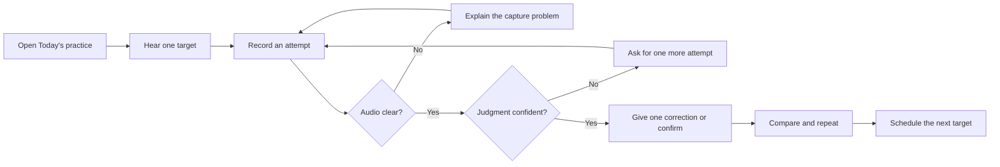

# Rǫdd app design

Status: proposed product baseline

Date: 29 September 2026

Platform: native macOS, Apple silicon

Initial language: English, with German sound anchors where useful

## Product promise

Rǫdd helps one learner build a confident, memorized pronunciation of the
eight-line Sigrdrífumál greeting. It works entirely on the Mac, explains the
historical convention it teaches, and gives no correction when the evidence is
too weak to justify one.

The initial product is deliberately narrow. It teaches one text under one named
reconstruction before adding more texts or pronunciation profiles.

## Definition of success

The first useful release succeeds when a learner can:

1. Start a guided practice session without configuring technical settings.
2. Hear a precise teaching reference and a more natural approximate reference.
3. Record a line and replay it beside either reference.
4. Receive one clear, evidence-backed correction or an honest “could not judge.”
5. See what to practice next and why.
6. Progress from imitation to an unprompted full recitation.

The product succeeds technically when it remains usable without a network
connection, keeps recordings on the device, and detects deliberately introduced
critical sound and length errors at the targets defined in the research design.

## Experience principles

### Teach, do not grade

The primary result of an attempt is the next useful action, not a percentage.
Mastery appears as plain stages: **New**, **Practicing**, **Reliable**, and
**Mastered**.

### One correction at a time

After each attempt, Rǫdd chooses the most important high-confidence issue. Other
possible issues stay out of view until the learner has addressed that one.

### Make uncertainty visible

Historical uncertainty and recognition uncertainty are different. The app
names both plainly:

- “This pronunciation has an accepted historical variant.”
- “The recording was not clear enough to judge. Try once more.”

Low-confidence historical details may be taught, but never block mastery.

### Keep prayer uninterrupted

Practice gives feedback after a short unit. Full recitation never interrupts the
learner and gives feedback only after the recording ends.

### Keep the system quiet

No leaderboard, streak pressure, celebratory noise, or red wall of errors. The
interface should feel focused, warm, and scholarly without resembling a
reference book.

## Core journey



## Information architecture

The app uses a compact sidebar with five destinations:

| Destination | Purpose |
|---|---|
| Today | A prepared seven-minute session and the default launch view |
| Lines | Browse and practice the eight individual lines |
| Sounds | Focused listening and production drills for recurring difficulties |
| Recite | Record the complete greeting without interruption |
| Progress | Review mastery, recurring sounds, and upcoming practice |

Profile, privacy, microphone, and storage controls live in macOS Settings rather
than adding another main destination. Pronunciation sources are reachable from
every lesson through a small **Why this pronunciation?** link.

## Screen designs

### First launch

The first run has three short steps:

1. **What Rǫdd teaches** — identifies the selected reconstruction and explains
   that it is documented rather than uniquely knowable.
2. **Private by design** — explains that analysis and recordings remain local,
   then requests microphone permission in context.
3. **Sound check** — checks input level and background noise with a short spoken
   sample. It does not judge pronunciation.

The learner may then begin the first session. Advanced model and storage choices
do not appear during onboarding.

### Today

The top of the view says what the session contains, such as “2 lines · 1 sound ·
about 7 minutes.” A single **Begin** button starts it. A secondary link allows
the learner to change the session length for today only.

During the session, a small step indicator shows progress without a countdown.
The scheduler alternates listening, imitation, correction, and later recall so
the session does not feel like a string of tests.

### Line practice

This is the central working screen:

```text
┌──────────────────────────────────────────────────────────────┐
│ Line 2 of 8                                  Practicing      │
│                                                              │
│ Heilir dags synir!                                           │
│ [word-by-word pronunciation guide]                           │
│                                                              │
│ Precise reference  ▶   Natural reference  ▶   Speed: 0.8×   │
│                                                              │
│                    [ Hold to record ]                         │
│                                                              │
│ Next focus                                                   │
│ Keep the final g audible as a back fricative before s.       │
│                                                              │
│ Reference  ▶     Yours  ▶     [ Try again ]     [ Continue ] │
└──────────────────────────────────────────────────────────────┘
```

Before recording, the lower panel contains a short listening or mouth-position
cue. After recording, it becomes the feedback panel. The text can reveal word
and sound alignment, but color is never the only carrier of meaning. Selecting a
word plays just that word from both recordings.

Recording uses a large press-and-hold control by default, with an accessible
press-once alternative. A visible pre-roll prevents clipped beginnings. Escape
cancels; Space starts or stops when focus is not in another control.

### Sounds

Each workshop begins with discrimination before production. The initial set is:

- short and long vowels;
- single and doubled consonants;
- /y/ with the German **ü** anchor;
- /ɣ/ contrasted with /g/;
- /ð/;
- tapped or trilled /r/.

A workshop states where the sound occurs in the prayer, offers a concise mouth
and tongue cue, and returns the learner to a real word or line after the drill.

### Recite

The full text remains visible, with an option to hide it for retrieval practice.
The app records continuously and shows only recording state and elapsed time.
Afterward, it presents:

- the strongest part of the recitation;
- one priority for the next practice session;
- a line-by-line review entry point;
- the learner and reference recordings for comparison.

### Progress

Progress answers three questions: “What can I recite?”, “What sound needs work?”,
and “What comes next?” The main view shows the eight lines in textual order with
their mastery stage and next review. A second section groups repeated,
high-confidence issues by sound. It does not expose raw model confidence or a
single overall pronunciation score.

### Pronunciation sources

The source sheet names the active profile, content version, evidence confidence,
accepted variants, and citations in reader-friendly language. It keeps detailed
evidence available without forcing it into the learning flow.

## Visual and sound direction

Rǫdd should feel calm, tactile, and contemporary. The visual language may take
inspiration from manuscript materials, but it should not imitate parchment,
runes, or a fantasy game.

| Element | Direction |
|---|---|
| Color | Warm off-white canvas, near-black text, muted lichen accent, restrained amber for attention |
| Type | A highly readable system serif for the Old Norse text; system sans serif for controls and explanations |
| Layout | Generous space, one dominant task per screen, readable line lengths |
| Motion | Short functional transitions; all motion respects Reduce Motion |
| Success | Quiet confirmation and progression, not confetti or competitive rewards |
| Error | Neutral explanation with a direct recovery action; avoid punitive red |

Sound playback must never overlap unexpectedly. Reference and learner playback
stop each other, maintain the chosen output level, and expose no automatic sound
effects during prayer.

## Accessibility

The first release must support:

- full keyboard navigation and visible focus;
- VoiceOver labels, values, and recording-state announcements;
- text scaling without clipping or hiding controls;
- Increase Contrast, Differentiate Without Color, and Reduce Motion;
- captions or textual descriptions for every audio teaching cue;
- a non-hold recording option for motor accessibility;
- no mastery penalty for capture failures or the app declining to judge.

The historic letter forms must remain selectable and copyable. A brief character
guide explains forms such as **ǫ**, **ð**, and **þ** without silently replacing
them in the source text.

## Feedback language

Feedback follows a fixed structure:

1. name the relevant sound or location;
2. describe one physical or audible change;
3. invite an immediate retry.

Example: “Hold the **tt** in **nótt** longer. Let the closure last before you
release it, then try the word once more.”

When the app abstains, it explains whether the cause was recording quality,
recognition uncertainty, or historical variation. It never says merely “wrong.”

## Product and data boundaries

### Included in the first release

- one Classical West Norse or Old Icelandic profile, approximately 1200;
- the eight-line Sigrdrífumál greeting;
- two labeled synthetic reference styles;
- local recording, comparison, phone alignment, and length analysis;
- confidence-aware correction, scheduled practice, and local progress;
- English teaching text with selected German pronunciation anchors.

### Deliberately deferred

- modern Icelandic as a separate reading profile;
- iPhone or iPad versions;
- accounts, cloud sync, social features, and leaderboards;
- additional works or user-authored texts;
- claims of uniquely correct historical prosody;
- numeric public scores or certification.

### Local data

Every attempt stores the content version, model version, target, result, and
mastery effect. Recordings are local and can be retained, automatically expired,
or disabled after analysis. Deleting practice history also deletes its retained
recordings. The application requires no network permission after its assets are
installed.

## System shape

The application has five cooperating areas:

| Area | Responsibility |
|---|---|
| Learning interface | Sessions, lessons, recording, feedback, and progress |
| Audio | Capture, quality checks, reference playback, and A/B comparison |
| Assessment | Known-text sound recognition, alignment, length, and cautious rhythm guidance |
| Coaching | Select one correction and schedule later practice |
| Content and history | Load the signed prayer pack and retain versioned local progress |

The prayer pack is a separate, versioned asset containing text, pronunciation
targets, accepted variants, evidence, lesson notes, and references. Assessment
cannot mark a low-confidence target as failed. Updating a prayer pack or model
does not rewrite old results.

## Release gates

The first alpha is ready for use only when all of the following are true:

- every target pronunciation has a recorded derivation and confidence level;
- high-confidence rules have two independent scholarly sources where available;
- accepted variants pass without correction;
- controlled critical sound and length errors are detected at least 85% of the
  time, while accepted synthetic variants are rejected less than 5% of the time;
- a line result appears within 700 milliseconds on the target M4 Mac;
- microphone and recognition failures lead to useful recovery instructions;
- a complete seven-minute session works offline with VoiceOver and keyboard;
- deleting history removes the related retained recordings;
- all historical and acoustic uncertainty language has passed a product review.

## Decisions still requiring evidence

These are research tasks, not choices to make by taste:

- the exact normalized eight-line source text;
- the phone-level contract and accepted variants;
- the two reference-generation methods and their licenses;
- the recognition model that best meets accuracy, size, license, and latency
  needs after conversion to Core ML;
- the amount and default lifetime of retained audio;
- whether the proposed mastery thresholds remain meaningful after calibration.

The prioritized work needed to settle these decisions is in
[the backlog](../BACKLOG.md).
