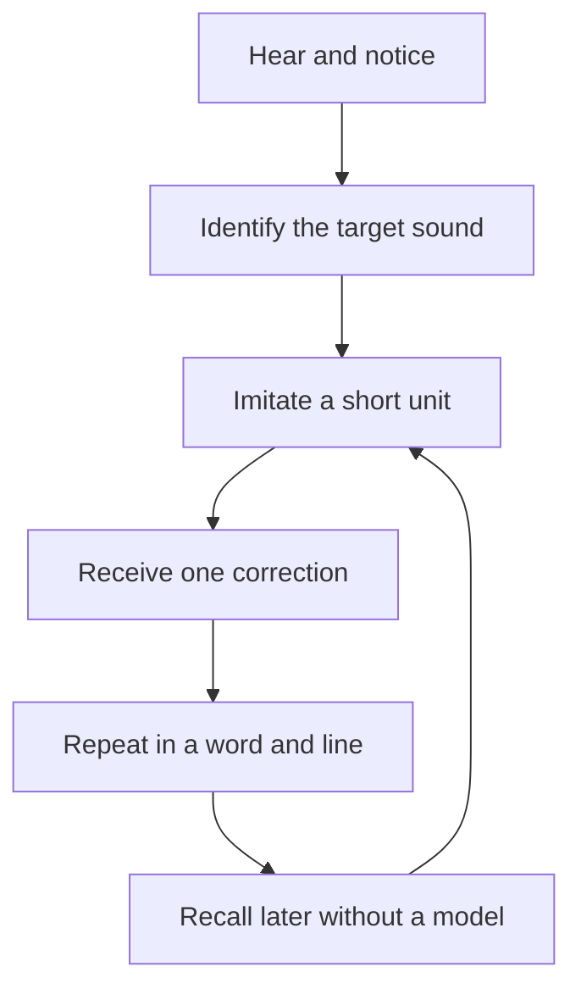
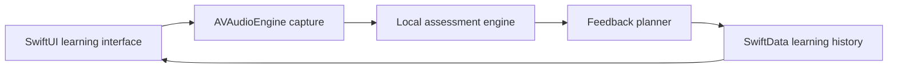

# Rǫdd: Local Old Norse Pronunciation Coach

Product and technical design, 27 September 2026

## Recommendation

Build a native, offline macOS application focused first on the eight lines of the Sigrdrífumál greeting. The app should not use ordinary speech-to-text or a synthetic Icelandic voice as its judge. It should use:

1. A declared historical pronunciation profile, initially Classical West Norse or Old Icelandic, approximately 1150 to 1300.
2. A source-triangulated phonetic transcription with explicitly permitted variants and confidence levels.
3. Two synthetic reference tracks: a precise phonetic rendering and a more natural but explicitly approximate rendering.
4. A local multilingual phone recognizer, constrained by the known prayer text.
5. Separate scoring for sound identity, vowel and consonant length, completeness, rhythm, and pauses.
6. Confidence-aware coaching that gives one concrete correction at a time.

The working name **Rǫdd** means “voice.”

## Why this requires a special methodology

Old Norse has no living native speakers and no recordings. “Correct” must therefore mean faithful to a documented reconstruction, not identical to an unknowable historical speaker.

The Sigrdrífumál text itself is securely preserved in the Codex Regius, but a manuscript does not encode every phonetic detail. The University of Texas Old Norse course describes a reconstructed “classical period” pronunciation for approximately 1150 to 1350 and separately notes the common practice of reading Old Norse with modern Icelandic pronunciation. These are related but different systems. Mixing them would make automated correction incoherent.

Rǫdd must therefore begin with a **pronunciation contract**:

| Contract field | Initial decision |
|---|---|
| Text | Normalized Codex Regius reading of the two greeting stanzas |
| Primary profile | Classical West Norse or Old Icelandic, approximately 1200 |
| Secondary profile | Modern Icelandic reading, available later and clearly labeled |
| Canonical representation | IPA at phone level, plus syllables, stress, length, and word boundaries |
| Variants | Variants supported by the selected scholarly sources |
| Precise reference | Phoneme-controlled synthesis optimized for sound identity and duration |
| Natural reference | Icelandic or multilingual neural speech adapted toward the reconstruction, clearly labeled approximate |
| Authority | Versioned evidence ledger with source and confidence for every rule |

The IPA used in the earlier experimental audio should be treated as a draft. It becomes the application's training target only after each word has been derived independently from the declared phonology rules and checked against at least two academic sources. This is a reproducible reconstruction, not expert certification.

### Evidence-triangulated pronunciation contract

Without an available reviewer, the contract should be generated by rule instead of intuition:

1. Start with the normalized Codex Regius text.
2. Derive each phone from a published classical Old Norse phonology.
3. Check the rule against a second independent scholarly grammar or university course.
4. Compare the resulting word with any available scholarly Old Norse reading.
5. Record the evidence, disagreement, selected form, and confidence as data.

Every phone receives one of three confidence levels:

| Confidence | Meaning | Coaching behavior |
|---|---|---|
| High | Sources agree and the phonological rule is clear | Grade normally |
| Medium | A defensible reconstruction with competing analyses | Accept documented variants |
| Low | Insufficient evidence or unstable realization | Teach as guidance, never fail an attempt |

This makes uncertainty inspectable and prevents the application's own synthetic audio from becoming circular proof of correctness.

## Learning methodology

Pronunciation training research supports self-paced repetition, immediate explicit feedback, phoneme-level diagnosis, and varied listening models. It also shows that segmental feedback, such as vowels and consonants, is generally easier to automate reliably than rhythm and intonation. Rǫdd should reflect that evidence.

### The learning loop



### Stage 1: Hear and discriminate

Before asking for production, the app teaches the target contrast. Examples include short versus long vowels, single versus doubled consonants, and the difference between /g/, /ɣ/, and /x/ in their relevant contexts.

Exercises:

- Listen at 0.65x, 0.8x, and natural speed.
- Tap which of two pronunciations matches the historical profile.
- Hear both the precise and naturalized synthetic tracks, plus any legally usable scholarly examples.
- Show a concise mouth and tongue instruction.
- Offer English and German sound anchors where useful. German **ü** is a particularly useful anchor for Old Norse **y**.

### Stage 2: Produce small units

Practice moves from phone to syllable, word, phrase, line, then full recitation. Difficult words such as **dagr**, **nótt**, **okkr**, **fjǫlnýta**, and **læknishendr** become reusable drills.

Each attempt follows this sequence:

1. Hear the precise or naturalized reference, optionally slowed without changing pitch.
2. Record.
3. See word and phone alignment.
4. Receive the single highest-value correction.
5. Hear an A/B comparison between the reference and the learner.
6. Repeat immediately.

Giving only one correction avoids a wall of red marks and makes the next attempt purposeful.

### Stage 3: Integrate rhythm and verse

Once the phones are stable, the coach adds:

- Stressed syllables.
- Vowel and consonant quantity.
- Pause locations.
- Phrase rhythm and F0 contour.
- Optional alliteration cues.

Prosody should be described as “closer to the selected reference style,” not as historically certain.

### Stage 4: Retrieval and mastery

The learner progresses from listen-and-repeat to delayed recall:

- Immediate retry.
- Later in the same session.
- Next day.
- Three days later.
- One week later.
- Three weeks later.

A line is mastered only after three acceptable unprompted attempts across at least two sessions, with no critical phone or quantity error. One high score is not enough.

## Assessment methodology

### 1. Capture and audio-quality gate

Use `AVAudioEngine` for microphone capture. Convert internally to 16 kHz, mono, linear PCM for the recognition model while retaining the original recording for playback.

Before pronunciation analysis, reject or warn about:

- Clipping.
- Very low input level.
- Excessive background noise.
- Speech beginning before capture.
- Long interruptions or multiple speakers.

This prevents microphone problems from becoming false pronunciation corrections.

### 2. Constrained phone recognition

The text is known, so open-ended transcription is unnecessary. A multilingual CTC phone recognizer produces frame-level probabilities over IPA-like phones. The decoder evaluates:

- The canonical phone sequence.
- Approved historical variants.
- Plausible learner substitutions.
- Insertions and deletions.

The initial baseline should be Meta's Apache-2.0 `wav2vec2-xlsr-53-espeak-cv-ft`, which emits phonetic labels and was built for cross-lingual phone recognition. It is not an Old Norse model, so its outputs must be calibrated rather than trusted directly.

The 2026 PhoneticXEUS model is a promising challenger. Its paper reports state-of-the-art phone error rates across multilingual and accented speech benchmarks. It should be evaluated after license, Core ML conversion, model size, and latency are verified.

### 3. Segmentation-free Goodness of Pronunciation

Classic Goodness of Pronunciation, or GOP, estimates how strongly the acoustic model supports the intended phone relative to alternatives. Recent CTC-based methods avoid brittle forced phone boundaries and can handle insertion, deletion, and substitution errors.

For each expected phone, compute:

- Evidence for the intended phone.
- Evidence for the strongest competing phone.
- Alignment confidence.
- Duration relative to the contract's quantity rule and the generated reference distribution.
- Whether the phone was omitted or an extra phone was inserted.

Do not convert raw model probabilities directly into a user-facing percentage. They are model confidence values, not historical truth.

### 4. Quantity and timing

Old Norse vowel length and doubled consonants deserve their own dimension. The University of Texas guide describes long sounds as approximately twice the duration of short sounds and doubled consonants as held longer than single ones.

Rǫdd should compare relative duration within the phrase, normalized for the learner's speaking rate. Feedback should say:

> Hold the **tt** in **nótt** longer. Your closure was close to a single **t**.

It should not demand an absolute millisecond value unless the reference distribution supports one.

### 5. Prosody and fluency

Use dynamic time warping to compare normalized pitch, energy, pause, and syllable-duration contours with the reference tracks. Without human reference performances, prosody is guidance only. It must not reduce mastery or be described as historically correct.

### 6. Confidence-aware decision policy

Each diagnosis has both an error score and a confidence score.

| Confidence | App behavior |
|---|---|
| High | Give a specific articulatory correction |
| Medium | Ask for another attempt, then combine evidence |
| Low | Say the app could not judge, check audio, or defer to A/B listening |

Silence is better than a confident but wrong correction.

### Provisional score composition

For progress tracking, not as a claim of historical accuracy:

| Dimension | Initial weight |
|---|---:|
| Phone accuracy and completeness | 55% |
| Vowel and consonant quantity | 20% |
| Stress and required pauses | 10% |
| Fluency and self-correction | 15% |

These weights are internal heuristics and must be stress-tested with deliberately altered recordings. The interface should emphasize the next correction and mastery state, not the composite number.

## User experience

### Core screens

1. **Today's practice**: one seven-minute adaptive session.
2. **Line practice**: reference playback, record, alignment, and one correction.
3. **Sound workshop**: focused drills for /ɣ/, /y/, /ð/, trilled /r/, vowel length, and geminates.
4. **Full recitation**: continuous performance with feedback after completion, never during prayer.
5. **Progress**: mastery by line and recurring sound, not a competitive leaderboard.
6. **Pronunciation profile**: shows the selected historical convention and its sources.

### Feedback hierarchy

1. Missing or substituted meaning-bearing phone.
2. Wrong vowel or consonant length.
3. Contextual allophone, such as the relevant realization of **g**.
4. Stress and rhythm.
5. Fine phonetic similarity.

Examples of useful feedback:

- “Keep the final **g** audible as a back fricative before **s** in **dags**.”
- “Round **y** like German **ü**, without moving it toward English **oo**.”
- “Tap or trill the final **r** in **dagr**. It disappeared in this attempt.”
- “The long vowel in **nótt** needs more duration relative to the surrounding syllables.”

Examples to avoid:

- “Wrong pronunciation.”
- “72 percent accurate.”
- “Sound more Icelandic.”

## macOS application architecture



### Technology choices

| Concern | Recommended implementation | Reason |
|---|---|---|
| User interface | SwiftUI | Native macOS behavior and accessibility |
| Audio capture and playback | AVFAudio, `AVAudioEngine`, `AVAudioPlayerNode` | Low-latency local audio and waveform taps |
| Signal processing | Accelerate/vDSP | Fast normalization, correlation, spectral and contour features |
| Phone model | Core ML conversion of a CTC multilingual phone recognizer | Local inference on Apple Silicon |
| Constrained decoding | Swift or C++ dynamic programming module | Known text, variants, insertions, and deletions |
| Optional transcript check | SpeechAnalyzer on supported systems, or `whisper.cpp` | Completeness check only, not pronunciation grading |
| Persistence | SwiftData backed by SQLite | Attempts, mastery, settings, and content versions |
| Content | Signed local “prayer pack” | Versioned text, IPA, evidence, variants, synthetic references, and lessons |
| Privacy | App sandbox, no network permission after model installation | All recordings and analysis remain on the Mac |

### Internal components

```text
RoddApp
  UI
    TodaySessionView
    LinePracticeView
    SoundWorkshopView
    RecitationView
    ProgressView
  Audio
    CaptureService
    PlaybackService
    AudioQualityGate
  Assessment
    PhoneRecognizer
    ConstrainedCTCDecoder
    QuantityAnalyzer
    ProsodyAnalyzer
    ConfidenceCalibrator
  Coaching
    ErrorPrioritizer
    FeedbackTemplateEngine
    PracticeScheduler
  Content
    PrayerPackLoader
    PronunciationProfile
    ReferenceAudioStore
  Data
    AttemptRepository
    MasteryRepository
```

### Prayer pack structure

```json
{
  "packVersion": "1.0.0",
  "work": "Sigrdrifumal",
  "profile": "west-norse-ca-1200",
  "sourceText": "Heill dagr! Heilir dags synir!",
  "tokens": [
    {
      "surface": "Heill",
      "canonicalIPA": "source-derived-value",
      "acceptedVariants": [],
      "stress": 1,
      "teachingNotes": ["Preserve consonant length"]
    }
  ],
  "evidence": [
    {"rule": "geminate-ll", "source": "source-id", "confidence": "high"}
  ],
  "references": [
    {"kind": "phonetic-precise", "speed": 1.0, "file": "line-01-precise.caf"},
    {"kind": "naturalized-approximate", "speed": 1.0, "file": "line-01-natural.caf"}
  ]
}
```

Content and assessment model versions must be stored with every attempt. If the linguistic profile changes, old scores remain interpretable.

## Personalization

The first session should calibrate microphone level and the learner's speaking range. It should then sample the prayer's difficult sound inventory.

For an English and German speaker, Rǫdd can use bilingual articulatory anchors while avoiding assumptions about ability. It should learn recurring confusions from repeated, high-confidence evidence. For example, if /ɣ/ repeatedly becomes /g/, the next sessions should insert a brief /g/ versus /ɣ/ discrimination and production drill.

Personalization changes the order and explanation of practice, not the canonical historical profile.

## Calibration and validation without an expert

An application that corrects pronunciation without a human authority needs stricter limits on what it claims. Validation becomes evidence consistency, synthetic test coverage, and repeatability rather than expert agreement.

### Linguistic validation

- Every word has derived IPA, syllabification, stress, quantity, accepted variants, sources, and confidence.
- Each high-confidence rule is supported by at least two academic sources.
- Source disagreements remain visible in the content data and application.
- Low-confidence phones never cause failure.
- Modern Icelandic and reconstructed Old Norse remain separate profiles.

### Acoustic calibration set

- Generate canonical audio with at least two different synthesis pipelines.
- Generate controlled substitutions, omissions, insertions, shortened long vowels, and shortened geminates.
- Record natural learner attempts, including the intended primary user.
- Confirm that the scorer ranks the canonical and near-canonical forms above known altered forms.
- Test invariance across microphone distance, volume, speaking rate, and background noise.

### Acceptance metrics

| Measure | Alpha target |
|---|---:|
| Contradictions between two synthesis pipelines | Investigated and documented |
| Detection recall for injected critical phone and length errors | At least 85% |
| False rejection of accepted synthetic variants | Below 5% |
| Post-recording response on an M4 Mac | Under 700 ms per line |
| Fully offline operation after installation | 100% |
| User can complete a seven-minute session without technical choices | Yes |

False correction remains the most important risk. The application should prefer “try once more” or “uncertain” over a detailed diagnosis unless the acoustic evidence is strong and the target phone itself is high-confidence.

## Delivery plan

### Phase 0: Pronunciation contract, approximately 1 week

- Freeze the normalized prayer text.
- Select the historical profile.
- Build the source and rule evidence ledger.
- Derive canonical IPA, accepted variants, and confidence levels.
- Generate precise and naturalized reference tracks.

**Exit:** every target has reproducible derivation, two-source support where available, and an explicit confidence level.

### Phase 1: Honest coach prototype, approximately 2 to 3 weeks

- SwiftUI practice screen.
- Local recording and playback.
- Dual synthetic reference tracks at multiple speeds.
- CTC phone recognition and constrained alignment.
- Word and phone heat map.
- A/B playback.
- No numeric mastery score yet.

**Exit:** the app finds gross substitutions, omissions, and major length errors on curated test recordings.

### Phase 2: Calibrated alpha, approximately 3 to 5 weeks

- Confidence calibration.
- Error-priority rules.
- Quantity scoring and non-graded prosody guidance.
- Personal learner profile.
- Validation report using controlled acoustic mutations and cross-synthesis agreement.

**Exit:** injected error detection and false rejection targets are met, with abstention on uncertain cases.

### Phase 3: Teaching product, approximately 2 weeks

- Sound workshop.
- Adaptive seven-minute sessions.
- Retrieval schedule and mastery model.
- Full recitation mode.
- Accessible German and English teaching hints.

**Exit:** the learner can progress from first exposure to an unprompted full recitation.

## Key risks and controls

| Risk | Control |
|---|---|
| Treating modern Icelandic as historical Old Norse | Separate named profiles, never blend them |
| Model has never seen Old Norse | Known-text constrained decoding, controlled error tests, abstention |
| No human expert or native reference exists | Evidence ledger, two-source rule checks, accepted variants, confidence levels |
| Synthetic reference validates itself | Score abstract phone targets, compare two synthesis pipelines, inject known errors |
| Learner imitates synthetic voice artifacts | Separate phone accuracy from voice similarity and provide dual reference tracks |
| Slowed audio distorts phonetics | Regenerate at teaching tempo when possible, use careful time stretching only as a fallback |
| False precision from a percentage score | Mastery bands, confidence, and concrete corrections |
| Prosody model overclaims certainty | Label it reference-style similarity and weight it modestly |
| Model or content update invalidates history | Version every attempt with model and prayer-pack identifiers |
| Recordings leave the device | No cloud dependency, explicit local storage controls |

## Decision summary

The strongest first product is narrow and transparent: one prayer, one declared reconstruction, dual synthetic references, local phone-level analysis, and a confidence-aware feedback loop. Once that works, the prayer-pack format can support Hávamál passages, runic invocations, and other historical-language material without redesigning the app.

The immediate next step is building the source-backed pronunciation contract for the eight lines. After the IPA, variants, and confidence levels are reproducibly derived, the two reference tracks and scoring tests can be generated. The app can then teach a defined reconstruction honestly, even though it cannot claim unique historical correctness.

## Research sources

1. [Codex Regius electronic edition, Sigrdrífumál](https://eae.ku.dk/q?form=register&p=eae%2Fvols%2Fstruct%2F369163), Editiones Arnamagnæanæ Electronicæ, University of Copenhagen.
2. [Old Norse Online, pronunciation and grammar](https://lrc.la.utexas.edu/eieol/norol/10), Linguistics Research Center, University of Texas at Austin.
3. [Computer-assisted pronunciation training: A systematic review](https://doi.org/10.1017/S0958344024000181), ReCALL 37(1), 2025.
4. [A Framework for Phoneme-Level Pronunciation Assessment Using CTC](https://www.isca-archive.org/interspeech_2024/cao24b_interspeech.pdf), Interspeech 2024.
5. [Segmentation-free Goodness of Pronunciation](https://arxiv.org/abs/2507.16838), 2025.
6. [Wav2Vec2Phoneme documentation](https://huggingface.co/docs/transformers/model_doc/wav2vec2_phoneme), Hugging Face.
7. [Wav2Vec2 XLSR-53 multilingual phoneme model card](https://huggingface.co/facebook/wav2vec2-xlsr-53-espeak-cv-ft), Meta AI.
8. [An Empirical Recipe for Universal Phone Recognition](https://arxiv.org/abs/2603.29042), PhoneticXEUS, 2026.
9. [AVAudioEngine documentation](https://developer.apple.com/documentation/avfaudio/avaudioengine), Apple.
10. [SpeechAnalyzer introduction](https://developer.apple.com/videos/play/wwdc2025/277/), Apple WWDC 2025.
11. [whisper.cpp](https://github.com/ggml-org/whisper.cpp), local Apple Silicon optimized transcription option.
